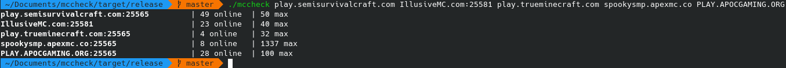

# mccheck

mccheck is a simple command line program to check how many people are on a given list of minecraft servers.

## Usage

`mccheck <your IPs, separated by space>`

For example: `mccheck 1.2.3.4 5.6.7.8:12345`